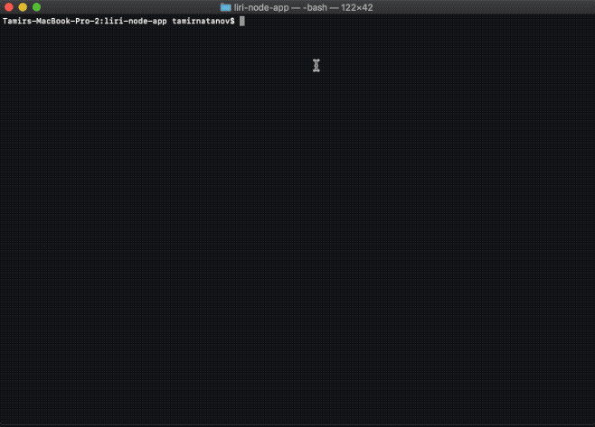

# __Liri Node App__

## __Set Up__

1. In order to safely run this node application run in the same file directory this application is saved in:
```
npm install
```

2. To use the Spotify API that is built into this application create a .env file.
    * In the same directory as this app (in terminal/bash):
```
touch .env
```
   
3. We will use this file to assign our local environment variables. Open the file in VScode, Copy and paste bellow:
    
```
SPOTIFY_ID=YOUR_SPOTIFY_ID
SPOTIFY_SECRET=YOUR_SPOTIFY_SECRET
```

## __How To Use__

1. To use the app in terminal/bash
```
node liri.js <Command> <Input>
```

2. Commands:
    * concert-this
    * spotify-this-song
    * movie-this
    * do-what-it-says

3. What each command does and its input.
    1. __concert-this__
        * Input - input takes in an artist name or band.
        * Will print to user upcoming concerts with location and time.
    2. __spotify-this-song__
        * Input - input takes in a song name.
        * Will print to user the first 5 searches of this song from spotify with band, album name, song name and preview link.
    3. __movie-this__
        * Input - input takes in a movie name.
        * Will print to user all infromation about that movie, if no input default movie is "Mr. Nobody."
    4. __do-what-it-says__
        * No Input.
        * This command will read a file random.txt, within that file is a command and input that is read by the application. Then runs that command in the application. To modify random.txt the formt is:
        ```
            COMMAND             INPUT
        spotify-this-song,"I Want it That Way"
        ```

## __Visual Examples__

